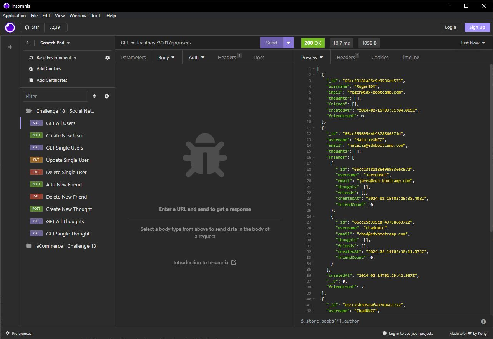

# Social Network API
 [](https://opensource.org/licenses/MIT)

An API for a social network web application where users can share their thoughts, react to friends’ thoughts, and create a friend list.

## Table of Contents
* [Installation](#Installation)
* [Dependances](#dependancies)
* [Usage](#Usage)
* [Screenshot(s)](#screenshot)
* [Demo](#demo)
* [Questions / Feedback](#questions--feedback)

## Installation
Clone the github library by running the following in your command prompt.
```
git clone git@github.com:CLTJared/Social-Network-API.git
```

1. After cloning, run `npm i` to install required package(s).
2. Run `npm run seed` to create initial seed of database
3. Run `npm start` to run server, or run `npm run dev`

### Dependancies
* NodeJS
* ExpressJS
* Mongoose
* MongoDB
    * See [MongoDB Installation](https://www.mongodb.com/docs/manual/installation/) and select your platform for instructions on installing

### Usage
Using [Insomnia](https://insomnia.rest/) or your favorite REST API testing utility, navigate to one of the following API routes below.

####  User Routes
| Method | Description | URL |
| --- | ----------- | --------|
| **GET** | View all user(s) | localhost:3001/api/users/ |
| **GET** | View single user | localhost:3001/api/users/:userId |
| **POST** | Create new user | localhost:3001/api/users |
| **DELETE** | Delete a user | localhost:3001/api/users/:userId |
| **PUT** | Update user information | localhost:3001/api/users/:userId |
| | *Example JSON* | {<br /> "username": "your-username",<br /> "email": "your-email" <br />} |
| **POST** | Add Friend | localhost:3001/api/users/:userId/friends/:friendId |
| **DELETE** | Delete Friend | localhost:3001/api/users/:userId/friends/:friendId |

#### Thought Routes

| Method | Description | URL |
| --- | ----------- | --------|
| **GET** | View all Thought(s) | localhost:3001/api/thoughts |
| **GET** | View Thought by ID | localhost:3001/api/thoughts/:thoughtId |
| **POST** | Create New Thought | localhost:3001/api/thoughts/ |
| | *Example JSON* | {<br /> "thoughtText": "Here's a cool thought...",<br /> "username": "JaredUNCC",<br /> "userId": "65cc23181a85e9e9536ec572" <br />} |
| **PUT** | Update Existing Thought | localhost:3001/api/thoughts/:thoughtId |
| | *Example JSON* | {<br /> "thoughtText": "Here's a cool thought update..." <br />} |
| **DELETE** | Delete Existing Thought | localhost:3001/api/thoughts/:thoughtId |
| **POST** | Add Reaction | localhost:3001/api/thoughts/:thoughtId/reactions |
| | *Example JSON* | {<br /> "reactionBody": "Here's a cool reaction...",  <br />} |
| **DELETE** | Delete Reaction | localhost:3001/api/thoughts/:thoughtId/reactions/:reactionId |


### Screenshot


### Demo
Watch a video demonstrating the API route usage - [Social Media API](https://app.screencastify.com/v3/watch/3j5k7sGPTcb8Bo5kotF0)